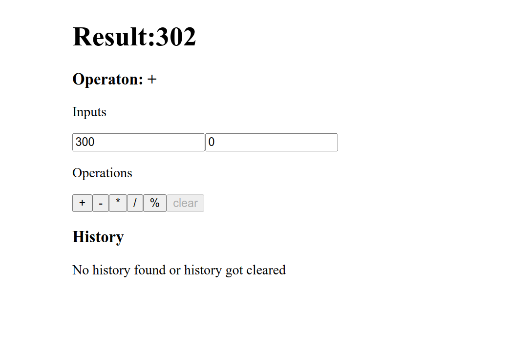

# Calculation Tracking CRUD React App

This is a simple CRUD (Create, Read, Update, Delete) application built using React. The app allows users to track various calculations, store them in a history, and perform operations such as adding, subtracting, multiplying, dividing and get modulus calculations.

## Features

- **Create**: Add new calculations to the history.
- **Read**: View previously stored calculations.
- **Update**: Edit any calculation in the history.
- **Delete**: Remove calculations from the history.
- **Clear History**: Clear all stored calculations at once.
- **Restore Operations**: Retrieve any deleted calculations or revert to a previous state.

## Technologies Used

- React
- JavaScript (ES6+)
- CSS (for styling)
- Local Storage (for persisting data)
